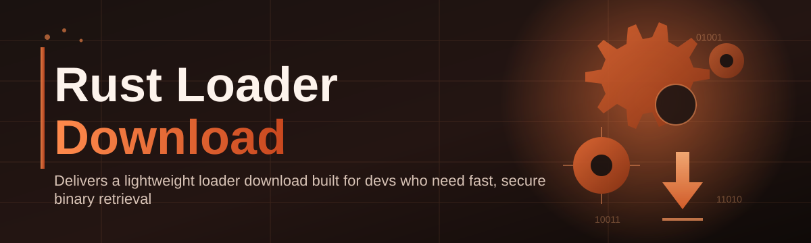

# rust-loader-manager 🚀🦀

  

*One tidy little app that turns "where did I even put that loader" into "oh, it's right here."*

  

## 🧭 Overview

Let's be honest — the "Rust Loader Download" ecosystem is a mess. Everyone's got their own folder structure, their own naming conventions ("final_v2_REAL_this_time.exe"), and their own personal graveyard of outdated builds sitting in Downloads. I built **rust-loader-manager** on a weekend because I got tired of doing this manually, and it turns out a lot of other people were tired of it too. What started as a scrappy script to organize my own loader binaries turned into a full-blown desktop manager with a UI, update checks, and a workflow that actually makes sense.

This project exists for one reason: managing Rust-related loader downloads shouldn't require a spreadsheet, three browser tabs, and a prayer. Whether you're a developer testing loader builds, a hobbyist tinkering with Rust-based tooling, or someone who just wants a clean, versioned, single source of truth for their downloads folder — this tool is built for you. It's not trying to be an IDE, a package manager, or a replacement for cargo. It's a focused, opinionated manager that does one job extremely well: getting the right build, from the right source, onto your machine, without the ceremony.

Under the hood it's a lightweight Windows desktop app — no background services phoning home, no bloated Electron shell pretending to be native. Just a fast, purpose-built manager that respects your CPU fans and your patience.

## ⬇️ Get It

  

> [!TIP]
> Bookmark the landing page above — that's the only place you'll ever need to check for the latest build. Everything else in this README is just context.

---

## 🔥 What Makes This Thing Tick

- **Version fingerprinting** — every download gets hashed and tagged so you never accidentally run a stale build again. No more guessing which file is "the good one."

- **Smart re-download detection** — if a file already exists and matches, the manager skips the network call entirely. Bandwidth is not infinite, my friend.

- **One-click launch pipeline** — download, verify, and open in a single flow. Three clicks total, start to finish.

- **Local history log** — a scrollable timeline of everything you've ever pulled down, with timestamps, so you can answer "wait, when did I get this build?" without digging through folders.

- **Dark-first UI** — because it's 2026 and staring at a white background at 2am is a crime against your retinas.

- **Zero background footprint** — the app runs when you open it and disappears when you close it. No tray icon quietly eating your RAM.

- **Portable-friendly layout** — everything lives in one directory. Move it, zip it, throw it on a USB stick — it doesn't care.

- **Built-in changelog viewer** — see what changed between versions without leaving the app.

> [!NOTE]
> All of the above runs entirely client-side. There's no telemetry phoning home, no analytics pixel, no "anonymous usage data" nonsense buried in a settings toggle you'll never find.

---

## 🏁 How to Get Started

1. **Visit the landing page** using the download button above — that's the canonical, always-current source.

2. **Download the standalone build** — it's a single package, no installer wizard holding your hand through eleven "Next" clicks.

3. **Run it** — Windows might grumble with a SmartScreen prompt because the binary isn't signed by a mega-corp yet. Click "More info" → "Run anyway."

4. **Point it at your loader downloads folder** on first launch, and you're done. The app takes it from there.

> [!IMPORTANT]
> This is a Windows-only tool for now. If you're on macOS or Linux, I hear you, but porting a native Win32-flavored UI isn't a weekend project — it's a "next quarter" project.

---

## 💻 System Requirements

| Requirement | Details |
|---|---|
| OS | Windows 10 (64-bit) or Windows 11 |
| Dependencies | None — fully standalone |
| Disk space | ~40 MB for the app itself |
| RAM | Basically anything from the last decade |
| Internet | Required only for fetching downloads |

No .NET runtime installs, no Visual C++ redistributable roulette, no "please install this other thing first." It just runs.

---

## ⚙️ How It Works

The architecture is deliberately boring, which is a compliment. Boring things don't break.

1. The app launches and reads your local config (paths, theme, last-used settings).
2. On request, it reaches out to the source endpoint to check for the current build.
3. It compares the remote version against what you've already got locally.
4. If there's a newer version, it fetches it and verifies the download.
5. The manager hands off the ready-to-run file to your launch step.

<strong>Why not just use a browser bookmark?</strong>

Because browsers don't dedupe files, don't hash-verify anything, and definitely don't keep a clean history of what you grabbed and when. A bookmark is a link. This is a workflow.

---

## 🧩 Troubleshooting

**Q: The app won't open, Windows just flashes a warning and closes it.**
A: That's SmartScreen being cautious about unsigned binaries. Click "More info" then "Run anyway." Signing certificates cost real money and this is a passion project, not a startup.

**Q: My antivirus flagged the download.**
A: Loader-adjacent tools get flagged more than they should — heuristic scanners are trigger-happy with anything that touches downloads and file verification. Submit it as a false positive to your AV vendor if you're concerned, or check the hash against what's listed on the landing page.

**Q: It says "version mismatch" even after I redownloaded.**
A: Clear the local cache folder inside the app's settings tab and retry. Sometimes a partial download leaves a corrupted fingerprint behind.

**Q: Can I point it at a custom download source?**
A: Not yet — that's on the roadmap. Right now it's tuned specifically for the official landing page pipeline.

**Q: Does it work offline?**
A: The UI opens fine offline, but obviously fetching new builds requires an internet connection. History and previously downloaded files remain accessible.

**Q: Why is it Windows-only?**
A: Because that's where the vast majority of the "Rust Loader Download" audience actually lives. Never say never on cross-platform, though.

---

## 🎨 UI / UX Details

The interface is minimal on purpose — I wanted something that felt fast, not something that felt "designed."

- **Themes:** Dark (default), Light, and a Midnight Blue accent variant.

- **Keyboard shortcuts:**
  - `Ctrl+D` — trigger download check
  - `Ctrl+R` — refresh version status
  - `Ctrl+L` — open local history log
  - `Ctrl+,` — open settings
  - `Esc` — close any open modal

- **Settings panel** lets you configure your download directory, toggle auto-check-on-launch, and switch themes without restarting the app.

- **Status bar** at the bottom always shows current version, last check time, and connection state — glanceable, not distracting.

  

> [!WARNING]
> Don't manually edit the local config JSON while the app is running — it'll get overwritten on the next save cycle and your changes will vanish into the void.

---

## 🤝 Contributing & Community

This started as a solo weekend build, but it's grown legs. Contributions, issue reports, and feature requests are genuinely welcome — I read every single one.

> [!TIP]
> Before opening an issue, check if it's covered in the Troubleshooting section above. Half the "bugs" reported so far turned out to be SmartScreen warnings.

If you want to contribute:

- Fork the repo and open a pull request with a clear description of what changed and why.
- Keep PRs focused — one feature or fix per PR makes review painless.
- Discuss bigger architectural changes in an issue first, before writing 2,000 lines of code nobody asked for.

---

## 📜 License

Released under the [MIT License](LICENSE), 2026. Do what you want with it — build on it, fork it, learn from it. Just don't slap your name on it and pretend you built it from scratch.

---

## ⚠️ Disclaimer

This project is provided "as is," without warranty of any kind. It's a tool for managing and organizing downloads related to Rust-based loader tooling — it does not host, distribute, or endorse any specific third-party binaries. Use it responsibly and in accordance with the terms of whatever content you're managing with it.

  

